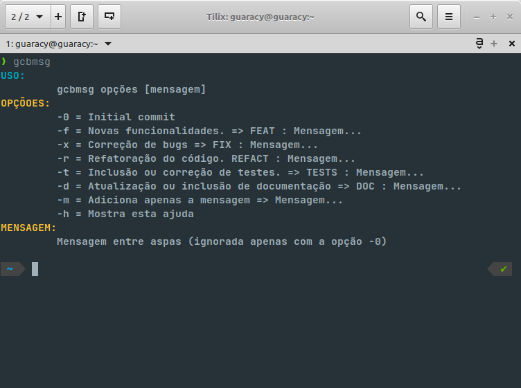
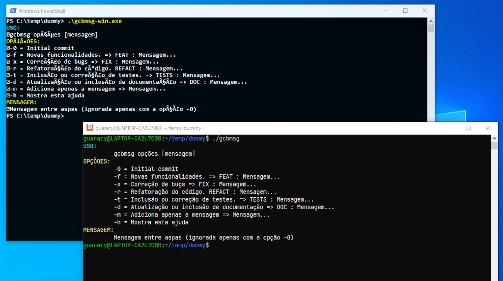
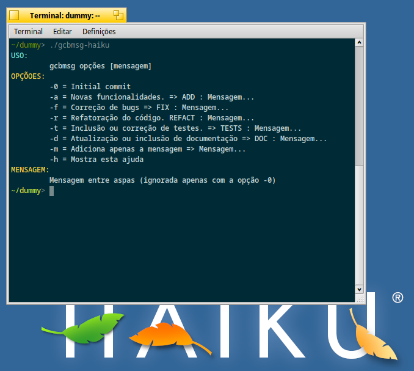
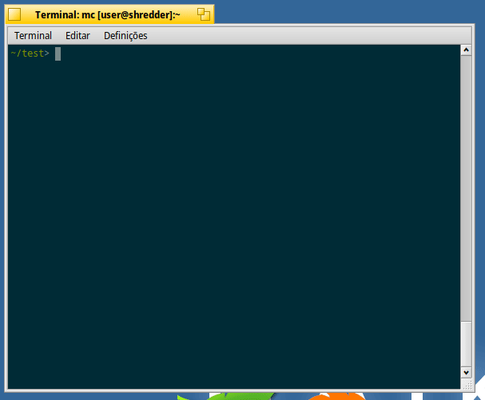

# Reinventar a roda. Característica dos programadores.

*É um problema pois temos trocentas coisas parecidas e diversas horas de talento jogadas fora e que poderia ser utilizadas para outras coisas mais nobres.*

Mas pretendo focar no lado que **não** é um problema.

No mundo real também temos coisas parecidas. Um mesmo produto alimentício pode ser diet, light, normal, etc.. Carros existem de diversas cores, características, tecnologias, formatos e preços (só não existem os populares :D ).

Diversos fatores podem levar o programador a fazer ou programa similar a outro. 

- Quem conheceu Ruby no início sabe do [code kata](https://en.wikipedia.org/wiki/Kata#Outside_martial_arts). Praticar e resolver problemas faz com que o programador assimile a linguagem e se torne melhor e mais apto a resolver os problemas quando surgirem. Então resolve fazer o programa na linguagem que ele usa ou está aprendendo.

- Um programa pode conter características em demasia e ele acha que o programa deveria ser mais enxuto e resolve fazer a versão dele.

- O programa está em uma linguagem que ele não domina ou gosta e resolve fazer a versão dele.

- Apenas por não saber que já existia um programa que fazia aquilo. 

- Apenas para provar que a linguagem escolhida também pode fazer aquilo.

Por aí vai. Recentemente foi publicado o artigo  [Ferramenta para padronização de commits - GEC (Git Easy Commit)](https://www.tabnews.com.br/HenriikOliveira/ferramenta-para-padronizacao-de-commits-gec-git-easy-commit) que teve como ideia [Escrever commits melhores](https://www.tabnews.com.br/AllanCapistrano/escrever-commits-melhores). Existem outros. 

Ok, programas interessantes mas .... . 

Tirando o tamanho do programa em Go, não acho legal aqueles menus. Gostaria de algo simples e direto como os programas que estou acostumados no Linux. Então tá. Vamos reinventar a roda.

- Gostaria de algo que executasse como: `cmd -x "correção"` e fosse traduzido para `git commit -m "FIX : correção"`.  

- Gostaria que ele fosse compilado e ligado estaticamente (não dependesse de bibliotecas externas)

Se Pascal já foi usado para fazer o primeiro SO gráfico (Lisa), programas como as primeiras versões do Photoshop (não sei como é agora), WPS (sabe aquela suite concorrente do Excel que roda no Linux e Windows?) entre outros, poderia ser uma boa candidata.

O nome? Como uso o `zsh` com Oh `My ZSH` e possui o alias `gcmsg mensagem` que executa um `git commit -m "mensagem"` e já estou acostumado, vou nomear como `gcbmsg`.

Tec, tec, tec, ctrl+c, ctrl+v, tec, ctrl+x, tec. Tec, ctrl+s. Pronto. Agora é só testar.

Ok. Perfeito de primeira. :D

Entro `gcbmsg -0` e ele executa `git commit -m "Initial commit"`. Entro com `gcbmsg -x "correções"` e ele transforma em `git commit ḿ "FIX : correções"`. Ah, mas eu queria que tivesse a opção `-b` para sair `BILUBILU : mensagem`. Fácil. Os fontes foram disponibilizados. Um fork, inclui a opção e recompila. Ou pode usar a opção `-m`  e entrar que ele assume só a mensagem informada.

Muito fácil. Vamos compilar para Windows, mas sem sair do Linux. Basta criar um novo perfil, informar o processador e o SO e recompilar selecionando o novo perfil. Pronto. Um executável para Windows sem alterar nenhuma linha de programa.

Ok. A versão para Linux funcionou bem no WSL. O Power Shell (sic) não sabe lidar com UTF-8. Dane-se. Eu não uso ele mesmo. 

Bem, vamos parar por aqui. Espera um pouco. Será que funciona no [Haiku](https://www.haiku-os.org/) ? Vamos tentar. Criamos o novo perfil e ... funciona.

 

Então tá. Tirando Mac que eu não tenho como testar, funciona nos três melhores sistemas operacionais (Linux, Haiku e WSL).

Por enquanto era isso.

Reinventar a roda é divertido.

